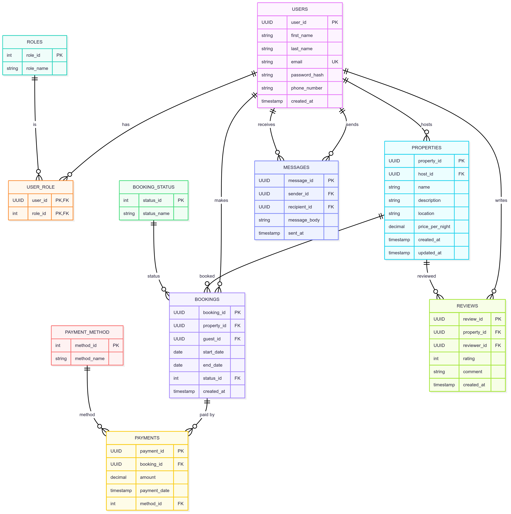

## 1. Issues found in the original ER‑diagram
| # | Observation | Normalisation Principle at Risk | Why it matters |
|---|-------------|---------------------------------|----------------|
| 1 | `USER.role` is an **ENUM** that can hold only one value, but in practice a person can be guest *and* host (or even admin). | 1NF (repeating / multivalued data) & 3NF (future role attributes would be transitively dependent) | Changing or adding roles requires table alteration and makes many‑to‑many queries harder. |
| 2 | `BOOKING.total_price` is **derived** from *price per night × number of nights* and can go out‑of‑sync with `PROPERTY.price_per_night`. | 3NF (transitive dependency via `PROPERTY.price_per_night`) | Redundant data → update anomalies. |
| 3 | `PAYMENT.amount` will normally equal `BOOKING.total_price` (1‑to‑1) resulting in duplication. | 3NF | Risk of inconsistencies between booking and payment totals. |
| 4 | `BOOKING.status`, `PAYMENT.payment_method` are ENUMs that encode business data in the schema. | 1NF & 3NF | Hard to extend (e.g., add *“refunded”*), no FK protection. |
| 5 | The same free‑text `location` string is stored for every property – not strictly a violation, but leads to poor queryability and potential spelling variants. | Optional | A separate `LOCATION` table improves consistency. |

## 2. Normalisation steps applied
Below you can see how the schema was reshaped step‑by‑step until it satisfied **Third Normal Form (3 NF)**:

1. **Remove multi‑valued attributes**  
   *Created table `ROLES` and bridge table `USER_ROLE` (PK: user_id, role_id) so that a user can hold many roles.*

2. **Replace ENUM columns with lookup tables**  
   *`BOOKING_STATUS(status_id, status_name)` and `PAYMENT_METHOD(method_id, method_name)` protect allowed values via FKs and let us add metadata later.*

3. **Eliminate derived / redundant attributes**  
   *`total_price` is dropped from `BOOKING`; the actual charge is recorded once in `PAYMENT.amount` (allowing partial or split payments if the business ever requires it).*

4. **Rename surrogate FKs for clarity**  
   *`BOOKING.user_id` ➜ `guest_id` – self‑documenting and avoids confusion with `host_id` in `PROPERTY`.*

5. (**Optional**) **Normalise locations**  
   *Created `LOCATION(location_id, street, city, state, country, postal_code)` and pointed `PROPERTY.location_id` to it for cleaner geo‑queries.*  
   *(Skip this step if a single free‑text field is sufficient for MVP.)*

After these transformations every non‑key column depends **only** on the key, the **whole** key, and **nothing but** the key – meeting 3 NF.

## 3. Final 3 NF schema

### Core tables
| Table | Primary Key | Key columns | Purpose |
|-------|-------------|-------------|---------|
| **USERS** | user_id | first_name, last_name, email, password_hash, phone_number, created_at | All platform members |
| **ROLES** | role_id | role_name | Lookup for user roles |
| **USER_ROLE** | (user_id, role_id) | – | M:N between USERS & ROLES |
| **PROPERTIES** | property_id | host_id ↠ USERS, name, description, location (or location_id), price_per_night, created_at, updated_at | Listings offered by hosts |
| **BOOKING_STATUS** | status_id | status_name | Lookup for booking lifecycle |
| **BOOKINGS** | booking_id | property_id ↠ PROPERTIES, guest_id ↠ USERS, start_date, end_date, status_id ↠ BOOKING_STATUS, created_at | Reservation made by guests |
| **PAYMENT_METHOD** | method_id | method_name | Lookup for payment channels |
| **PAYMENTS** | payment_id | booking_id ↠ BOOKINGS, method_id ↠ PAYMENT_METHOD, amount, payment_date | Monetary transactions |
| **MESSAGES** | message_id | sender_id ↠ USERS, recipient_id ↠ USERS, message_body, sent_at | Private messages |
| **REVIEWS** | review_id | property_id ↠ PROPERTIES, reviewer_id ↠ USERS, rating, comment, created_at | Feedback after stay |

## Normalised 

